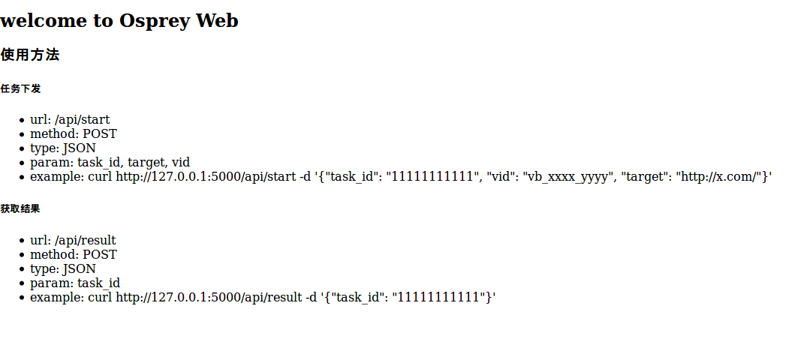

# Osprey  [](https://www.python.org/)

Osprey是由TCC(斗象能力中心)出品并长期维护的开源漏洞检测框架

### 简介

Osprey——鱼鹰，一种善于捕鱼的猛禽，取此命名漏洞盒子PoC框架，寓意快、精、准。

Osprey是一个可扩展的开源漏洞检测与利用框架(Python3开发)，是TCC长期的安全能力与经验的积累形成的一个可用工具，目前被集成应用于企业级安全产品 [```网藤风险感知-CRS```](https://www.riskivy.com/product/crs) 中。 Osprey框架可供使用者在渗透测试、漏洞检测、漏洞扫描等场景中应用。框架提供了命令行接口和Web接口，可供灵活调用，也可用于构建自己的扫描器。

### 安装

从Git上获取最新版本的osprey代码

``` bash
$ git clone https://github.com/TophantTechnology/osprey.git
```

推荐在Linux环境下使用，并用virtualenv搭建独立的python3环境
``` bash
$ python3 -m venv venv
$ source venv/bin/activate
```

#### 最小化安装

最小化安装仅提供命令行和一个交互式的Console接口，可满足大多数场景下的使用。

``` bash
$ python setup.py install 
```

#### 完全安装

安装osprey的完整功能，包括命令行工具、 交互式Console接口、 Web API接口。


- 安装配置RabbitMQ
- 安装配置MongoDB
- 配置 [```settings.py```](./settings.py)
  1. 使用MongoDB作为数据库：use_mongo = True, use_sqlite = False
  2. 填充RabbitMQ和MongoDB的URI：mongo_url, CELERY_BROKER
  3. 填写你的Python3解释器路径：PROGRAM
- 安装Python包:

``` bash
$ pip install -r web/requirements.txt
```

### 使用

- 获取帮助列表：

``` bash
$ python osprey.py --help
```

- 最简单的用法，针对一个目标URL，发起一个PoC做检测：

``` bash
$ python osprey.py -t URL -v POC_ID
```

- 使用交互式Console接口：

``` bash
$ python console/osprey-console.py
```

- 使用Web API接口：

``` bash
$ gunicorn -b 127.0.0.1:5000 osprey-web:app -w 5
$ celery -A osprey-web.celery worker --concurrency=5 -Q poc-queue -n osprey.%h -Ofair
```

### Docker使用

可以使用docker-compose快速搭建完整的Osprey环境（需安装docker和docker-compose）

编译docker环境

``` bash
$ cd docker
$ docker-compose build
```

运行完整的osprey环境

``` bash
$ docker-compose up -d
```

访问`http://YOUR-IP:5000/`，可以看到osprey Web部署已完成



利用docker搭建osprey的Web接口下发任务和获取执行结果

``` bash
$ curl http://127.0.0.1:5000/api/start -d '{"task_id": "TASK_ID", "vid": "vb_ID", "target": "http://x.com/"}'
$ curl http://127.0.0.1:5000/api/result -d '{"task_id": "TASK_ID"}'
```

osprey镜像拉取到本地之后，也可以直接通过docker run进入容器中（不启用osprey-web），然后使用命令行工具或交互式Console接口

``` bash
$ docker run -it -v pocs:/opt/osprey/pocs docker_osprey bash
```

### 相关文档

基于Osprey编写PoC，请参考 [osprey编写规范和要求说明](doc/PoC_specification.md)

要使用Osprey Web接口，请参考 [osprey-web接口使用说明文档](doc/web_api_tutorial.md)

Osprey-鱼鹰交流群：483373752

### 参考链接

- [Vulbox](https://www.vulbox.com/)
- [TCC-Group](https://www.vulbox.com/knowledge)


 


